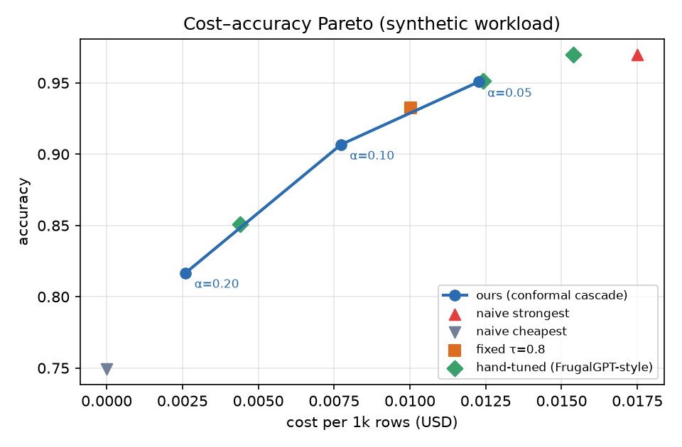
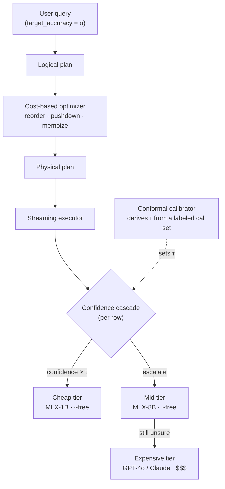
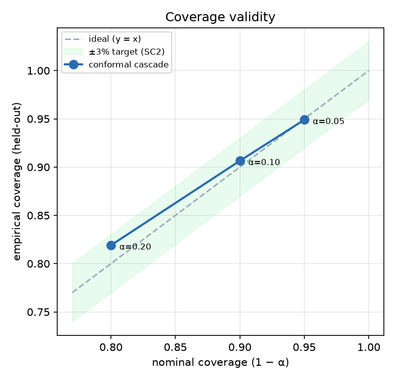
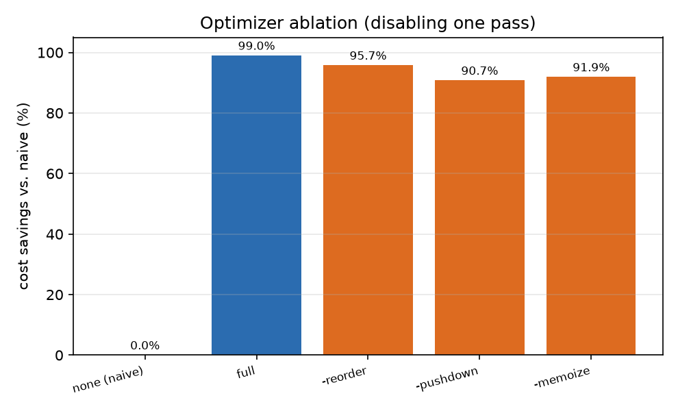

# semopt

**A cost-optimal query engine for LLM semantic operators — with a conformal accuracy guarantee.**


Run database-style queries over unstructured text where a language model answers each row —
*without* paying to run the strongest model on every row. `semopt` routes each row through a
**cheap → mid → expensive model cascade** and escalates only when the cheap model is unsure,
where the escalation threshold is **derived (not hand-tuned)** by weighted conformal
calibration to meet a user-specified accuracy target `P(error) ≤ α`.

> **You name the accuracy; the engine finds the cheapest way to deliver it — with a
> finite-sample coverage guarantee.**

<p align="center">
  
</p>

At a 90% accuracy target, the cascade reaches **0.907 accuracy at ~16% of naive
strongest-model cost** — and, unlike a hand-tuned baseline, it hits the target instead of
overshooting and overspending. *(Numbers from the built-in synthetic workload; see
[Status](#status--honesty).)*

---

## Why

Systems like LOTUS, Palimpzest, and DocETL let you query unstructured data with LLM-evaluated
predicates. Their shared bottleneck is **cost**: one LLM call per row, at the strongest model,
does not scale — a 100K-row filter at $0.01/row is $1,000 per query. Model cascades cut this by
trying a cheap model first, but they pick the escalation threshold heuristically, so the
resulting accuracy is whatever the heuristic happens to produce.

`semopt`'s contribution is to make that threshold **principled**: it turns a small labeled
calibration set into a threshold with a distribution-free, finite-sample guarantee on the
end-to-end error rate.

## What's inside

- **Five semantic operators** — `sem_filter`, `sem_map`, `sem_extract`, `sem_join`, `sem_rank`,
  over an immutable, provenance-tracking table.
- **A conformal cascade** — per-row confidence scoring (logprobs or self-consistency) plus a
  weighted-conformal calibrator that derives the escalation threshold τ.
- **A cost-based optimizer** — filter reordering by cost × selectivity, LLM-predicate pushdown,
  and semantic memoization, each individually toggleable.
- **Pluggable backends** — local MLX models (Apple silicon), OpenAI / Anthropic APIs, and
  deterministic mocks; all calls memoized in a persistent cache for free, reproducible replay.
- **Explainability** — `explain()` prints the optimized plan; per-row JSONL `trace`; a
  self-contained HTML cascade dashboard.

## Quickstart

```bash
# uv (https://github.com/astral-sh/uv) is used for env + deps
uv pip install -e ".[dev]"     # core engine + dev tooling (no model backend needed)

uv run pytest                  # 107 tests
uv run python -m semopt.demo   # sem_filter over 100 rows with logged cost + cache replay
make full                      # reproduce every number and figure below
```

Optional model backends (the core engine and all tests run without them):

```bash
uv pip install -e ".[mlx]"     # local Apple-silicon models (MLX)
uv pip install -e ".[api]"     # OpenAI / Anthropic API models
uv pip install -e ".[plots]"   # matplotlib, for the figures
```

## Example

```python
from semopt import SemanticTable

reviews = SemanticTable.from_parquet("reviews.parquet")

# You state the accuracy; semopt calibrates the cascade to guarantee it.
complaints = reviews.sem_filter(
    "Does this review complain about shipping or packaging?",
    target_accuracy=0.90,
)
```

For a full pipeline with the optimizer, build a lazy query and inspect the plan:

```python
q = (reviews.query()
        .project(["text"])
        .filter("complains about shipping?", model=cheap)
        .filter("mentions a refund?",        model=cheap))

print(q.explain())     # optimized plan + estimated cost
result = q.collect()   # optimize, then execute
```

## How it works



**The guarantee.** At a tier, accept the cheap answer when confidence `c ≥ τ`, else escalate.
Calling an accepted-but-wrong row a *leaked error*, we pick the smallest τ (maximizing cheap
acceptance) such that on exchangeable test data `P(model wrong ∧ c ≥ τ) ≤ α`. τ is a weighted
quantile of the incorrect calibration rows' confidences with a finite-sample correction; under
covariate shift the points carry density-ratio weights (Tibshirani et al., 2019).

## Results

*All figures below are produced by `make full` from fixed-seed scripts. **The workload is a
built-in synthetic generator with a known difficulty structure** — see [Status](#status--honesty).*

**Coverage validity** — the accuracy you *ask for* matches what you *get*, within ±3%:

| α | target `1−α` | empirical | cost vs. naive |
|---|---|---|---|
| 0.05 | 0.95 | 0.949 | 0.26× |
| 0.10 | 0.90 | 0.906 | 0.16× |
| 0.20 | 0.80 | 0.819 | 0.06× |

<p align="center">
  
  &nbsp;&nbsp;
  
</p>

**Optimizer ablation** — the full optimizer removes 99% of estimated cost vs. a naive plan;
disabling one pass shows its contribution (reorder, pushdown, memoize).

## Reproducibility

Every headline number traces to a script + fixed seed; the LLM cache makes reruns deterministic.

| Command | Produces |
|---|---|
| `make coverage`  | `outputs/coverage_sweep.csv` — coverage vs. α (SC2) |
| `make pareto`    | `outputs/pareto.csv` — cost–accuracy vs. baselines B0–B5 |
| `make ablation`  | `outputs/optimizer_ablation.csv` — optimizer breakdown |
| `make dashboard` | `outputs/trace.jsonl` + `outputs/cascade_dashboard.html` |
| `make figures`   | `docs/img/*.png` — the charts above |
| `make full`      | all of the above |

## Project layout

```
src/semopt/
├── table.py            # SemanticTable — the front door
├── operators/          # sem_filter · map · extract · join · rank
├── cascade/            # confidence scoring · conformal calibration · dispatcher
├── planner/            # logical plan · selectivity · optimizer · physical/explain
├── models/             # MLX · OpenAI/Anthropic · mock backends
├── cache/              # persistent SQLite memoization (deterministic replay)
├── cost/               # per-model cost model (costs.yaml)
├── eval/               # metrics (F1/span-F1/NDCG) + baselines B0–B5
└── report/             # per-row trace + HTML cascade dashboard
benchmarks/             # synthetic generator + real-workload loader contracts
experiments/            # run_coverage · run_pareto · run_ablations · make_figures
report/                 # main.tex (paper draft) + figures
```

## Status & honesty

The engine, all five operators, the conformal cascade, the optimizer, the baselines, the
reporting, and the figures are **complete, tested, and reproducible** (107 tests, `ruff` +
`mypy --strict` clean, 89% coverage).

**All headline numbers are on the built-in synthetic workload and are labeled as such.**
Evaluation on the three real workloads (Amazon Reviews complaint classification, arXiv triage,
CUAD clause extraction) needs dataset downloads *and* a real model backend (an API budget or
local MLX weights), so it is the next step rather than a current claim. The loader contracts and
data-hygiene notes live in `benchmarks/`; the eval harness runs unchanged once a loader returns
real data. `report/main.tex` is a paper draft in which every synthetic number is visibly tagged.

## References

- Patel et al. **LOTUS: Enabling Semantic Queries with LLMs over Tables.** 2024.
- Liu et al. **A Declarative System for Optimizing AI Workloads (Palimpzest).** 2024.
- Chen, Zaharia, Zou. **FrugalGPT.** 2023.
- Tibshirani, Foygel Barber, Candès, Ramdas. **Conformal Prediction Under Covariate Shift.** NeurIPS 2019.
- Angelopoulos, Bates. **A Gentle Introduction to Conformal Prediction.** 2023.

## Citation

A workshop paper is in preparation. Until then, please cite the repository:

```bibtex
@software{bhusal_semopt,
  author = {Bhusal, Samjhana},
  title  = {semopt: Cost-Optimal Query Execution for LLM Semantic Operators},
  year   = {2026},
  url    = {https://github.com/samjhana-bhusal/semopt}
}
```

## License

MIT — see [LICENSE](LICENSE).
